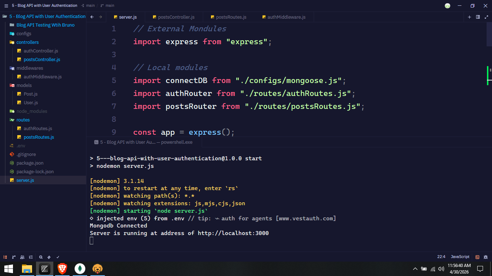
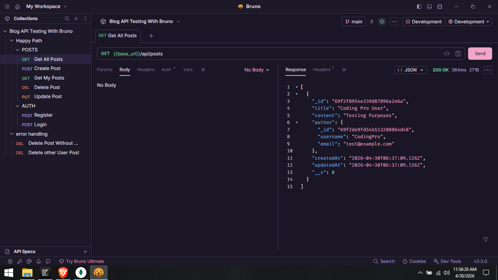

# 🚀 Secure Blog API (Node.js, Express, MongoDB & Mongoose)

A robust, stateless Backend API for a blogging platform. This project implements full **CRUD** functionality with a focus on **Identity Management** and **Resource Authorization**.

## ✨ Key Features
*   **User Authentication**: Secure registration and login using `bcrypt` for password hashing and `JSON Web Tokens (JWT)` for session management.
*   **Post Management**: Full Create, Read, Update, and Delete (CRUD) operations for blog posts.
*   **Protected Routes**: Custom middleware to ensure only authenticated users can access private endpoints.
*   **Resource Authorization**: Strict ownership logic preventing users from editing or deleting posts they did not create.
*   **Data Populating**: Efficiently fetching author details (username/email) using Mongoose population.

## 🛠️ Tech Stack
*   **Runtime**: Node.js
*   **Framework**: Express.js
*   **Database**: MongoDB with Mongoose ODM
*   **Security**: JWT (jsonwebtoken), Bcrypt
*   **Dev Tools**: **Zed** (Code Editor), **Bruno** (API Client)

## 📂 Project Structure
```text
├── /controllers       # Business logic (Auth & Posts)
├── /middlewares       # Authentication & Security "Bouncers"
├── /models            # Mongoose Schemas (User & Post)
├── /routes            # Express Route definitions
├── server.js             # Entry point
└── .env               # Environment secrets
```


## 🚀 Getting Started

### 1. Prerequisites
*   Node.js installed
*   MongoDB Atlas account or local MongoDB instance

### 2. Installation
```bash
git clone https://github.com/yourusername/blog-api.git
cd blog-api
npm install
```

### 3. Environment Setup
Create a `.env` file in the root directory:
```env
PORT=3000
MONGO_URI=your_mongodb_connection_string
JWT_SECRET=your_super_secret_key
```

### 4. Run the Server
```bash
npm start
```

## 🧪 Testing with Bruno
I have used **Bruno** for comprehensive API testing. The collection is organized into:
*   **Happy Path**: Standard successful operations (Login, Create Post, etc.).
*   **Error Handling**: Security tests for unauthorized access and forbidden ownership actions.


